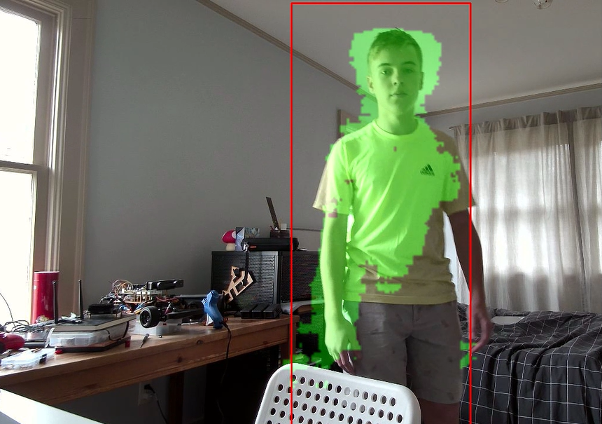

# Person_Detection
 

### Overview:
This is a convolutional neural network that can detect people. The CNN has 13 convolutional layers and 8 deconvolutional layers. It takes in an RGB image and ouputs a tensor with 5 channels per pixel (person_value, bbox x, bbox y, bbox width, bbox height). The output tensor is then inputed into the post proccessing. The post proccessing algorithm first finds blobs of pixels in the output mask which is the first channel. It then gets the average bounding box per blob. And finally it deletes any overlaping bounding boxes to prevent there being more than one bounding box per person.

In this project I wanted get data about how many people are in a room at my school and at what time. To do this I got this neural network to run on a Jetson Nano that used a camera to get live video footage of the room. I then calculated the number of people in the room using the neural network, and sent the data to the cloud using http. I graphed the results which can be found in the **visualizations** folder.

### Dataset
To train the nerual network I used the CrowdHuman dataset. It contains 15,000 annotated images with bounding boxes for each person in the image.

CrowdHuman Dataset: https://www.crowdhuman.org/

@article{shao2018crowdhuman,
    title={CrowdHuman: A Benchmark for Detecting Human in a Crowd},
    author={Shao, Shuai and Zhao, Zijian and Li, Boxun and Xiao, Tete and Yu, Gang and Zhang, Xiangyu and Sun, Jian},
    journal={arXiv preprint arXiv:1805.00123},
    year={2018}
  }
  
### Files
The code folder contains all of the programs for this project:
* **person_finder_AI.py** contains the neural network and is used to train the neural network.
* **data_collector_jetson.py** is the program that runs on the Jetson Nano. It calculates the number of people in the room and uploads it to the cloud.
* **data_parser.py** contains a function that parses the dataset and returns a numpy array of the dataset that has the filename and bounding boxes for each image.
* **model_tester.py** is used to run the neural network on normal computers.
* **model_tester_jetson.py** is used to run the nerual network on the Jetson Nano.
* **personnet_72.pt** is the saved model for the neural network.
* **graphs.py** draws graphs using the data collected.

### Running the Programs
#### Training
To train the nerual network download: train01, train02, train03, and annotations_train from the CrowdHuman dataset. Put all the files in a folder called "data" in the same directory as the person_finder_AI.py program. Then at the bottom of person_finder_AI.py where the train function is called, specify the parameters. Path to annotations is the annotations file that you downloaded. Path to data is the path to the folder where image folders 1, 2, and 3 are stored. Path to logs is where you want to store logs from the training. And path to model is what model to train. If you are starting with no model set it equal to None.
#### Testing
* To test the neural network on your **computer** run the **model_tester.py** program. Make sure that the personnet_72.pt file is in the same directory as model_tester.py, and that the correct camera is selected.
* To test the neural netowkr on a **Jetson nano** run the **model_tester_jetson.py** program on your Jetson Nano. Make sure the personnet_72.pt file is in the same directory as model_tester_jetson.py, and that the correct camera is selected.
